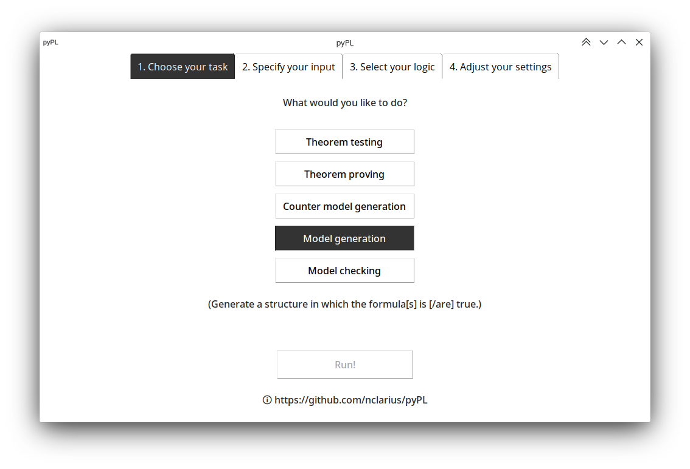
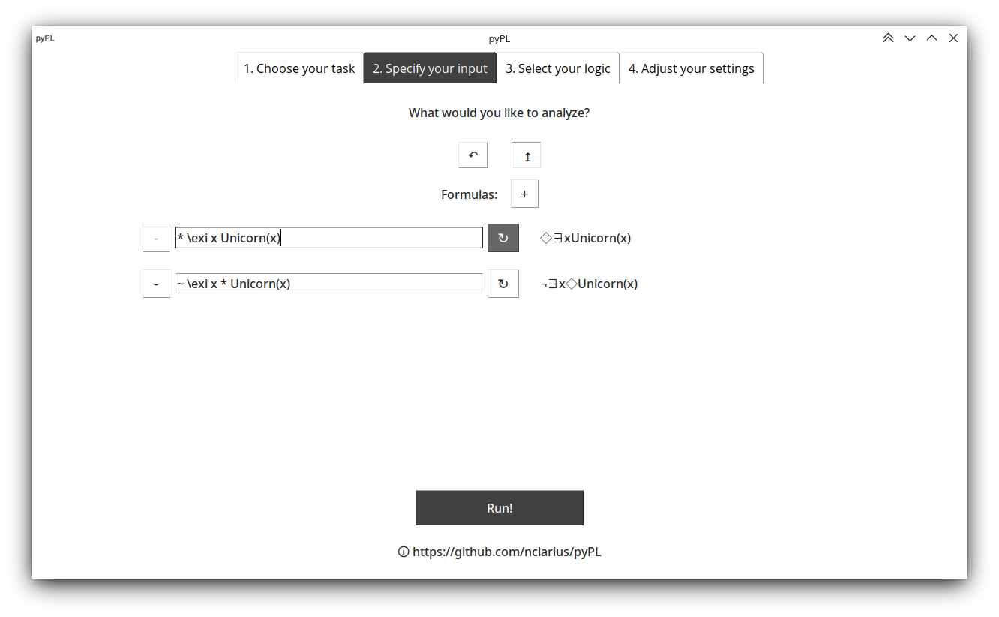
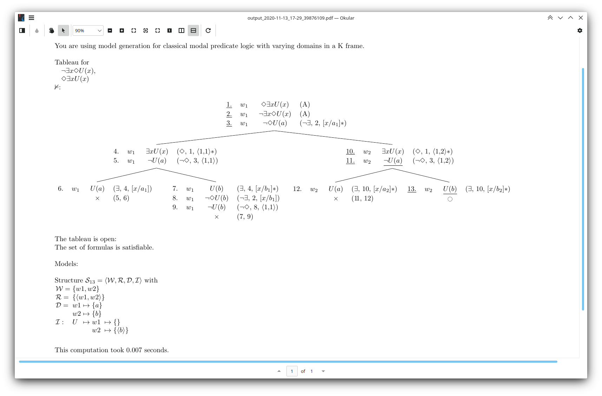

A naive model generator, model checker and theorem prover   
for some combinations of classical and intuitionistic, non-modal and modal, propositional and first-order logic.  

This tool can compute  
- the denotation (truth value) of a given logical expression in a given structure,  
- an analytic tableau with associated (counter) models for a given inference or set of formulas.   

© Natalie Clarius <natalie.clarius@student.uni-tuebingen.de>  
License: CC BY-NC-SA 4.0 (https://creativecommons.org/licenses/by-nc-sa/4.0/).

# Usage notes

### Try it out
**You can try the model checking feature of this tool out [here](https://trinket.io/python3/757871dd18).**  
If you want to dive in deeper, I recommend downloading pyPL to your own computer.

### Install and run
To run this tool locally on your machine:
1. Install dependencies: `Python` (version >= 3.9), `tkinter`, `pdflatex` (if you want nicely formatted output).
2. Clone this repository.
3. Execute `gui.py`.

How to 'clone github repository', 'install python', 'edit .py file' and 'execute .py script' is all easily googleable for your respective operating system.

### Specify input
Documentation on how to enter formulas, structures and input files can be found in `doc/Parser.md`.

# Disclaimer
- This implementation is intended for didactical purposes. It is not efficient or designed for real-life applications.  
- Although the program has been extensively tested, I do not guarantee soundness. Use at your own risk.

# Features

### Modes
- truth table generation
- model checking: evaluation of expressions relative to structures, variable assignments and possible worlds
- (counter) model generation: generate a structure in which a given (set of) formulas is true/false
- theorem proving: generate an analytic tableau to show that a formula or inference is valid/invalid

### Logics
- propositional logic
- first-order logic with zero-place predicates, function symbols and term equality
- intensional logic with operators ◻, ◇, ^, ⱽ; propositional, constant and varying domains; frame K
- intuitionistic logic with Kripke semantics (only model checking)

### Interface
- input of formulas and structures with ordinary keyboard characters, directly or from a file
- output in plain text or LaTeX-generated PDF

# Restrictions
 - model checking works only on structures with finite domains
 - model generation and theorem proving works only on formulas of relatively small size due to performance limitations

# Known issues
 - tableau algorithm relatively inefficient
 - GUI and parser sometimes glitchy
 - global variables are bad

# Wish list
- useful feedback on incorrectly entered input rather than no parser response
- more efficient proof search and model generation
- in model checking, print out detailed derivation rather than just final result of evaluation
- broader coverage:
  - lambda calculus and e-t type theory
  - more frames for modal logic; tense logic
  - model generation and modal logic for intuitionistic logic
  - tableaus with free variables
  - other frameworks and calculi, e.g. DRT, ND

# Have fun!

I am happy to learn about any bugs or improvement suggestions.
