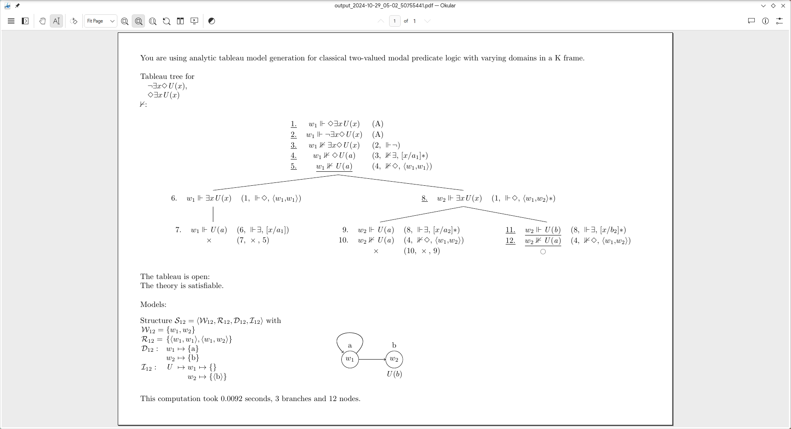

# pyPL

A naive model generator, model checker and theorem prover   
for some combinations of classical and intuitionistic, non-modal and modal, propositional and first-order logic, analytic tableau and sequent calculus.  

This software can compute  
- the denotation (truth value) of a given logical expression in a given structure,  
- a tableau or sequent deduction tree with associated minimal (counter) models for a given inference or set of sentences.

© Natalie Clarius <clarius@informatik.uni-tuebingen.de>  
License: CC BY-NC-SA 4.0 (https://creativecommons.org/licenses/by-nc-sa/4.0/).   

# Usage notes

### Try it out
You can try the model checking feature out [here](https://trinket.io/python3/757871dd18).  
If you want to dive in deeper, I recommend downloading pyPL to your own computer.

### Install and run
To run this software locally on your machine:
1. Install dependencies:
   - core functionality: [`Python`](https://www.python.org/downloads/) (version >= 3.9) + Python packages: `os`, `re`
   - for graphical interface: [`Tk`](https://tkdocs.com/tutorial/install.html)
   - for nicely formatted output: [`LaTeX`](https://www.latex-project.org/get/) with `pdflatex` + LaTeX packages: `geometry`, `array`, `forest`, `amssymb`, `amsmath`, `amstext`, `wasysym`, `mathtools`
2. Download this repository.
3. Execute `pyPL/main.py`.

### Specify input and view output
Documentation on how to enter formulas, structures and input files can be found in [`pyPL/doc/parser.md`](https://github.com/nclarius/pyPL/blob/master/doc/parser.md).  
Some sample input files are available in [`pyPL/input`](https://github.com/nclarius/pyPL/blob/master/input).  
Generated output files are stored in [`pyPL/output`](https://github.com/nclarius/pyPL/blob/master/output).  

### Troubleshooting
Information on the functionality of some of the buttons and options are shown as tooltips on mouse hover.  
For troubleshooting information, see [`pyPL/doc/troubleshooting.md`](https://github.com/nclarius/pyPL/blob/master/doc/troubleshooting.md).  
If that doesn't help, please open a GitHub issue or e-mail me.  

### Theory
Some background on the theory underlying the implementation can be found in [`pyPL/doc/paper.pdf`](https://github.com/nclarius/pyPL/blob/master/doc/paper.pdf).

# Features

### Modes
- theorem proving: generate an analytic tableau or sequent tree to show that a formula or inference is valid/invalid
- (counter) model generation: generate a minimal structure in which a given (set of) formulas is true/false
- model checking: evaluation of expressions relative to structures, variable assignments and possible worlds
- truth table generation

### Logics
- propositional logic
- first-order logic with zero-place predicates, function symbols and term equality
- intensional logic with operators □, ◇, ^, ⱽ; propositional, constant and varying domains; frame K
- intuitionistic logic with Kripke semantics (only model checking)
- three-valued logic (not yet implemented)

### Deduction systems
- analytic tableaux
- sequent calculus (classical logic only)

### Interface
- input of formulas and structures with ordinary keyboard characters, directly or from a file
- output in plain text or LaTeX-generated PDF

### Restrictions
 - model checking works only on structures with finite domains
 - model generation and theorem proving works only on formulas of relatively small size due to performance limitations

### Known issues
 - tableau algorithm relatively inefficient
 - GUI and parser can be glitchy (window not scrollable, buttons sometimes not behaving as expected, parser not always recognizing bracketing correctly)
 - global variables are bad

### Wish list
- useful feedback on incorrectly entered input rather than no parser response
- more efficient proof search and model generation
- in model checking, print out detailed derivation rather than just final result of evaluation
- broader coverage:
  - lambda calculus and e-t type theory
  - more frames for modal logic; temporal logic; model generation and modal logic for intuitionistic logic
  - tableaus with free variables
  - other frameworks and calculi, e.g. DRT, ND

### Disclaimer
- This implementation is an experimental proof-of-concept. It is not efficient or designed for real-life applications.  
- Although the software has been extensively tested, I do not guarantee soundness. Use at your own risk.

# Small Print

© 2021-2024 Natalie Clarius \<natalie_clarius@yahoo.de\> [nclarius.github.io](https://nclarius.github.io/)

This work is licensed under the GNU General Public License v3.0.  
This program comes with absolutely no warranty.  
This is free software, and you are welcome to redistribute and/or modify it under certain conditions.  

I am glad to receive comments, bug reports and improvement suggestions via GitHub issues or e-mail to natalie.clarius@student.uni-tuebingen.de.
