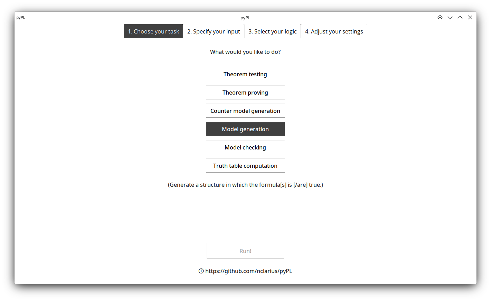
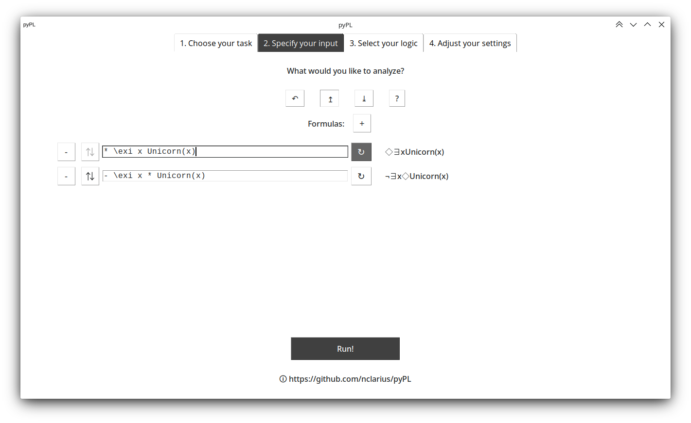

A naive model checker, model generator and theorem prover   
for some combinations of classical and intuitionistic, non-modal and modal, propositional and first-order logic.  

This tool can compute  
- the denotation (truth value) of a given logical expression in a given structure,  
- an analytic tableau with associated (counter) models for a given inference (**currently under construction**).   





© Natalie Clarius <natalie.clarius@student.uni-tuebingen.de>  
License: CC BY-NC-SA 4.0 (https://creativecommons.org/licenses/by-nc-sa/4.0/).

Disclaimer
----------
- This implementation is intended for didactical purposes. It is not efficient or designed for real-life applications.  
- Although the program has been extensively tested, I do not guarantee soundness. Use at your own risk.

I am happy to learn about any bugs or improvement suggestions.

Features
--------

```
 |                 classical                 |               intutionistic               |
 |    propositional    |    predicational    |    propositional    |    predicational    |
 | non-modal |  modal  | non-modal |  modal  | non-modal |  modal  | non-modal |  modal  |  
 |           |         |           | CD | VD |           |         |           | CD | VD |
 | MC |  MG  | MC | MG | MC |  MG  | MC | MG | MC |  MG  | MC | MG | MC |  MG  | MC | MG |
 |-------------------------------------------|-------------------------------------------|
 | 🗸  |  🗸  |  🗸 | 🗸  | 🗸  |  🗸  | 🗸  | 🗸  |  🗸 |  ✗  |  ✗ | ✗  |  🗸 |  ✗   | ✗  | ✗  |
MC = model checking, MG = model generation + tableau calculus;
CD = with constant domains, VD = with varying domains;  
modal MG only for K frames.
```
 - accepts languages
   - of propositional logic
   - of first-order logic with zero-place predicates, function symbols and term equality
   - with modal operators ◻, ◇
 - specification of structures (aka models, interpretations)
    - of classical logic
        - of PL with valuation function
          - with and without possible worlds
        - of FOL with domain, interpretation function and variable assignments
          - without possible worlds, with possible worlds with constant domains and possible worlds with varying domains
    - of intuitionistic logic (Kripke structures with sets of states)
        - of PL with valuation function
        - of FOL with domain, interpretation function and variable assignments
 - model checking: evaluation of expressions (non-log. symbols, terms, open formulas, closed formulas)
   relative to structures, variable assignments and possible worlds
 - analytic tableau proofs -- currently under construction
 - model generation -- currently under construction
 - output in plain text or LaTeX-generated PDF format

Restrictions
------------
 - works only on structures with finite domains and languages with a finite set of propositional or individual variables
 - no model generation and modal logic available for intuitionistic logic

Known issues
------------
 - global variables are bad
 - search strategy for tableaus is sometimes inefficient
 - tableaus and model generation for non-K frames not working properly

Wish list
---------
 - more user-friendly input and output:
   - expression parser instead of the cumbersome prefix notation
   - interactive mode/file input instead of need to edit source code in order to set up input
   - GUI
- in model checking, print out detailed derivation rather than just final result of evaluation
- broader coverage:
  - tableaus with free variables
  - more frames for modal logic
  - model generation for intuitionistic logic
  - modal logic for intuitionistic logic

Usage notes
-----------

(Usage instructions currently only apply to the model checking feature.)

### Try it out
**You can try this tool out [here](https://trinket.io/python3/757871dd18).**  
If you want to dive in deeper, I recommend downloading pyPL to your own computer.

### Installation and execution
To run this tool locally on your machine:
1. Clone this repository.
2. *Optional:* To specify custom input (see next subsection), edit the file `denotation.py` in a text editor of your choice.
3. Execute `denotation.py` in a terminal.

Running this program requires Python (version >= 3.8) to be installed on your machine.  
How to 'clone github repository', 'install python', 'edit .py file' and 'execute .py script in terminal' is all easily googleable for your respective operating system.

### Specifying input
**This tool is not equipped with an interactive user interface; input has to be specified in the source code.**  
A number of examples are already set up; this is the stuff you see when running the program.  
To specify your own input:  
- Structures and formulas to compute denotations for are defined in the function `compute_denot` in `denotation.py`.  
  Formulas, unfortunately, have to be entered in prefix notation.  
  Follow the existing examples and the documentations of the classes and methods to get an idea.  
- You can select which structures to include in the output by editing the variable `active` (near top of source code).
- You can select whether or not to print out intermediate steps by editing the variable `verbose` (same place).

After specifying your input in the source code, execute `denotation.py` in a terminal to view the output.

### If you would like to understand what's going on under the hood
- `denotation.py` is the main module in which input is specified and from which the computations are run.  
  `expr.py` defines the language and semantics, and `structure.py` the form of structures, of the logics.
  `tableau.py` computes tableau proofs and extracts models from them.
  `parser.py` is a formula parser.
- The interesting part for you are the `denot` (denotation) methods in each of the expression classes in `expr.py`.  
  Compare how the formal definitions can be translated into code almost 1:1,
  and try to follow why the implementation works the way it does, especially the loop logic for the quantifiers
  (classes `Exists` and `Forall` in `expr.py`).  
- To follow an evaluation process, I recommend to
  - set breakpoints at each of the `denot` method instances and step through an evaluation process symbol by symbol
    to see how a denotation is computed recursively in line with the inductive definitions.
  - trace (watch or simply print) the variables `v` and `v_` in the `denot` methods
    to keep track of what the current variable assignment looks like during quantifier evaluation.  
- The `__str__` methods are what makes the expressions formatted human-readable in the output.  
- Simply ignore all the print statements and anything that looks completely unfamiliar to you (such as `w`/modal stuff).  

### Notes on notation
- 'S' = structure/model (aka 'M')
- 'D' = domain of discourse (aka 'M', 'A')
- 'I' = interpretation function for non-logical symbols (aka 'F')
- 'g' = variable assignment function for individual variables (aka 'v')
- 'V' = valuation function for propositional variables

### Have fun!
